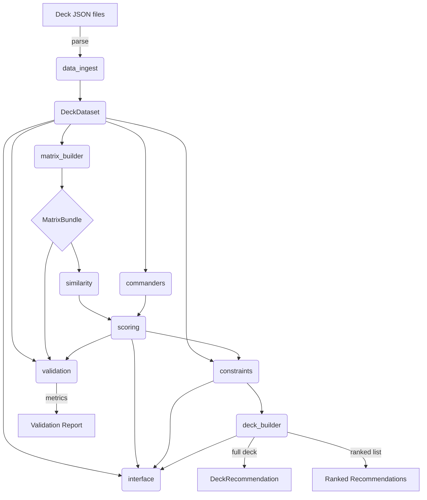

# magic-deck-rec
Recommend Magic cards for a deck based on public shared deck list.

## Project Goals
- Provide data-driven recommendations for Commander/EDH decks given a seed list of oracle IDs.
- Suggest card replacements and additions to reach a 100-card deck while respecting format constraints.

## Data Source
- data/deck_lists/*.json contains scraped Archidekt deck exports (one per deck).
- Each file stores commanders, card metadata (including oracle IDs, colors, legalities), and role tags to support heuristics.

## Algorithm Details
- **Commander priors**: while preprocessing, every deck contributes card counts to its commander(s). We normalise per-commander card frequencies to obtain P(card | commander) with additive smoothing. During scoring we blend the priors of the seed commanders (weighted by sample size) and add that as the "commander" component; explanations highlight the commanders that contributed the most.
- **Similarity core**: decks become rows in a sparse deck–card matrix. We compute item–item cosine similarity with overlap-based shrinkage and cache top-K neighbours for each card. When scoring, we sum the neighbour weights for all cards in the seed deck (excluding duplicates) and keep the top candidates.
- **Global frequency prior**: overall card counts add a log(freq) term so format staples receive a mild boost after similarity and commander priors.
- **Deck-shape heuristic**: functional role tags (Land/Ramp/Draw/Removal/etc.) feed target role counts (e.g. 38 lands). A candidate that improves an underrepresented role gains a small positive adjustment which we surface in the explanation.
- **Constraint filtering**: before surfacing candidates we apply commander legality, colour identity, and singleton checks (basic lands exempt) via `ConstraintChecker`.
- **Deck assembly**: the ranked output reports the top `N` candidates with their explanations. Full deck output either fills up to 100 cards or proposes swaps by removing low-impact cards while preserving role balance.
- **Validation harness**: `src/validation.py` holds out decks, reveals commanders plus partial card lists, and measures precision/recall @K when the recommender tries to recover the hidden cards (CLI: `python -m src.interface validate`).

## Recommendation Strategy
1. Ingestion: parse deck files into normalized records capturing commander oracle IDs, mainboard cards, color identity, type counts, and role tags.
2. Matrix construction: build a sparse deck-card incidence matrix plus global frequencies and role statistics.
3. Co-occurrence similarity: compute weighted cosine similarity between cards, caching the top-k neighbors per card for fast lookup.
4. Commander-conditioned priors: maintain P(card | commander) distributions; when commanders appear in the seed, add their prior weight to candidate scores.
5. Candidate scoring: combine neighbor similarities, commander priors, global frequency priors, and deck-shape need signals into a composite score.
6. Constraint enforcement: filter candidates against color identity, legality, singleton rules, and apply soft penalties for role or curve imbalances.
7. Deck assembly: produce (a) a ranked list of top candidates with explanations and (b) a completed 100-card list with suggested replacements.

## Constraint Handling
- Hard filters: commander color identity, Commander legality (including ban list), duplicate prevention (basic lands handled separately).
- Soft heuristics: target counts for lands, ramp, draw, removal, and mana curve distribution; applied during deck completion and replacement steps.

## Output Modes
- Ranked candidate list with scores and explanation snippets referencing supporting seed cards or commanders.
- Full 100-card deck recommendation, including suggested swaps and rationale for each addition or removal.

## Validation Plan
- Hold out a subset of decks and simulate user inputs by revealing commanders plus partial card lists.
- Measure precision@k and recall@k for the held-out cards; tune similarity weighting, commander prior strength, and constraint penalties.
- Provide a CLI or notebook entry point to rerun validation as parameters change.

## Roadmap
1. Implement data ingestion utilities and schema normalization.
2. Compute the deck-card matrix, global stats, and commander-conditioned priors.
3. Build the baseline similarity scorer and candidate ranking pipeline.
4. Add constraint filtering and deck shaping heuristics.
5. Implement recommendation outputs (ranked list and deck completion with explanations).
6. Build the validation harness and report metrics.
7. Future enhancement: experiment with latent embeddings (ALS or SVD) and blend them into candidate scoring.


## Dependencies
- Install Python requirements with `pip install -r requirements.txt` (currently includes `tqdm` for progress bars).

## Compact Dataset Schema
The preprocessed JSON (`data/processed/compact_dataset.json`) is a single dictionary with three top-level keys:
- `cards`: map of oracle id → card record containing
  - `oracle_id`: string identifier from Archidekt/Scryfall
  - `oracle_uid`: stable Scryfall oracle UUID for joining to external sources
  - `name`: card display name
  - `color_identity`: list of colour identity strings (e.g. ['Green', 'Blue'])
  - `types`: list combining super / card / sub types (e.g. ['Legendary', 'Creature', 'Elf', 'Druid'])
  - `mana_value`: converted mana cost as float
  - `roles`: list of functional tags extracted from the source deck (Land, Ramp, etc.)
  - `commander_legal`: boolean flag for Commander legality
- `decks`: list of deck objects, each with
  - `deck_id`: string identifier (matches the source filename/id)
  - `commanders`: list of oracle ids for commander cards
  - `color_identity`: deck colour identity inferred from commanders/mainboard
  - `card_counts`: mapping of oracle id → quantity in the deck (singleton except basics)
  - `role_counts`: mapping of role tag → count for the deck
- `commander_profiles`: map of commander oracle id → profile
  - `oracle_id`: repeated commander id for clarity
  - `color_identity`: commander colour identity
  - `sample_size`: number of decks observed for that commander
  - `card_frequency`: mapping of oracle id → normalised frequency P(card | commander)

This schema mirrors the in-memory DeckDataset structures, so the CLI can hydrate recommendations without re-reading every raw deck file.

## Data Preprocessing
- Run `python scripts/preprocess_decks.py --data-dir data/deck_lists --output data/processed/compact_dataset.json` to materialize a compact dataset.
- The output JSON stores `cards`, `decks`, and `commander_profiles` mirroring the in-memory structures used by the recommender.
- Adjust `--indent 0` for a minified file if disk size is a concern.
- The CLI commands default to `data/processed/compact_dataset.json`; rerun the preprocessing script or pass `--compact-path` to point elsewhere.
- Provide `--similarity-cache <file>` (with optional `--refresh-cache`) to reuse precomputed similarity neighbours between runs.
- Append `--verbose` to CLI commands (recommend/validate) to print progress and per-stage timings during recommendation/validation runs.

## Usage
1. Preprocess the raw deck exports:
   ```bash
   python scripts/preprocess_decks.py --data-dir data/deck_lists --output data/processed/compact_dataset.json
   ```
2. Fit the similarity model once and cache it:
   ```bash
   python -m src.interface recommend --deck-id 4211 --compact-path data/processed/compact_dataset.json        --similarity-cache data/processed/similarity_model.pkl --refresh-cache --top 0 --verbose
   ```
   Use any representative deck id; `--top 0` suppresses recommendation output while still building the cache.
3. Run recommendations and validation with the cached model:
   ```bash
   python -m src.interface recommend --deck-id 4211 --compact-path data/processed/compact_dataset.json        --similarity-cache data/processed/similarity_model.pkl --top 10 --verbose

   python -m src.interface validate --compact-path data/processed/compact_dataset.json        --similarity-cache data/processed/similarity_model.pkl --holdout-fraction 0.02 --seed-size 50 --verbose
   ```
   
4. Integrate in Python code (e.g., web app):
   ```python
   from src.inference import InferenceRecommender

   engine = InferenceRecommender(
       'data/processed/compact_dataset.json',
       similarity_cache='data/processed/similarity_model.pkl',
   )
   result = engine.recommend(["Elvish Warmaster", "Forest", "Rashmi, Eternities Crafter"], allow_unresolved=True, top_n=10)
   print('Unresolved:', result.unresolved)
   print('Deck additions:', result.deck.additions)
   ```

5. Quick CLI demo: `python scripts/demo_inference.py --cards "Elvish Warmaster" Forest foobar --verbose --allow-unresolved` (supports `--cards-file` JSON/TXT and reuse of `--similarity-cache`).


## Code Structure
- `src/models.py`: shared dataclasses for cards, decks, scores, and outputs.
- `src/data_ingest.py`: load scraped decks and build dataset lookups.
- `src/matrix_builder.py`: turn datasets into sparse matrices and statistics.
- `src/similarity.py`: compute and cache item-item similarity scores.
- `src/commanders.py`: manage commander-conditioned priors.
- `src/constraints.py`: enforce hard legality checks and soft role heuristics.
- `src/scoring.py`: blend similarity, priors, and heuristics into candidate scores.
- `src/deck_builder.py`: create ranked recommendations and full deck outputs.
- `src/validation.py`: run hold-out experiments and compute metrics.
- `src/interface.py`: CLI plumbing to run recommendations and validation.
- `src/__init__.py`: package exports for the core modules.

